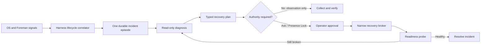

# Harness update and activation recovery report

**Incident studied:** Claude Desktop on Windows, 4 August 2026
**Scope:** detection, correlation, operator explanation, and safe recovery brokering
**Status:** architectural recommendation; the narrow AppModel watcher and detached Claude native-host attribution are already present in the working tree, but the lifecycle broker described here is not yet implemented.

## Executive finding

Foreman handled ordinary Claude child processes reasonably well, but this incident occurred outside the boundary of its main model. The update registered successfully, Windows then failed to activate the new package *before `Claude.exe` existed*, and a vendor service plus a detached browser helper outlived the visible app. Foreman's process-tree monitors therefore had no primary process to own the failure, while Windows' package status still looked healthy.

The right improvement is not another Claude-specific kill rule. Foreman should add a **harness lifecycle broker** that treats installation, update handover, activation, detached helpers, services, readiness, and recovery as one evidence-linked episode.

The governing invariant should be:

> A harness is healthy only when its expected activation route reaches a stable, usable state. A successfully installed package, a running helper, or a green package status is supporting evidence—not proof that the harness works.

Foreman should automatically gather and correlate read-only evidence. It should propose the smallest reversible repair, but require operator approval and, where appropriate, Presence Lock for service control, process termination, package repair, rollback, or reinstall. A harness may announce an update or request help; it must not be able to authorise its own destructive recovery.

## What happened

The following timeline is reconstructed from Windows AppX Deployment and AppModel Runtime logs, live process/service inspection, Foreman's persistent event log, and the recovery actions taken on this machine.

| Local time (ACST) | Evidence | Meaning |
|---|---|---|
| 2 August | `chrome-native-host.exe` under `%APPDATA%\Claude\ChromeNativeHost` remained alive with a `cmd.exe` parent | A detached Claude integration helper survived long after its useful parent/session. Its generic name and lack of a live Claude ancestor prevented reliable attribution. |
| 4 August, 11:58:16 | AppX deployment event 855: `Claude_1.24012.9.0` updating to `Claude_1.24012.11.0` | A real package update began. |
| 11:58:46–47 | Deployment events reported `CoworkVMService` terminated for update, the new package enabled, and deployment event 400 said registration finished successfully | Package servicing completed from Windows' deployment perspective. This did **not** prove that launch would work. |
| 11:58:47 onward | AppModel Runtime events 215 and 208 repeatedly reported `0x80070020`, first while converting the Desktop AppX job and then while configuring runtime/creating the process | Windows failed before the Claude primary process started. There was nothing for Foreman's WMI process watcher to observe. |
| 12:01–12:08 | Registration repair attempts again completed successfully, while every subsequent activation produced the same 208/215 pair | Re-registering the package did not restore operability. The episode produced repeated symptoms, not separate incidents. |
| During diagnosis | Stopping `CoworkVMService` and terminating the stale native host did not restore activation; launch attempts restarted the packaged service and failed again | The stale helper was relevant evidence but is **not proven to be the root cause**. The confirmed failure mechanism is the AppX runtime/job conversion failure; its originating Windows state remains uncertain. |
| 12:13 | The MSIX package was removed. Windows still logged sharing violations while deleting package user-hive files | Some package state remained locked even during uninstall. |
| 12:14 onward | The vendor-signed classic Claude build `1.24012.9` was installed and launched successfully | Basic Claude Desktop operability was recovered without deleting `%APPDATA%\Claude`. This was a fallback, not a full restoration: the classic build does not provide the modern packaged Cowork surface. |

Two details are especially important:

1. `Get-AppxPackage` reported the package as `Status: Ok`. Microsoft's `PackageStatus` model covers conditions such as tampering, missing dependencies, servicing and availability; it is not a launch-readiness probe. In this incident a package could therefore be “OK” and still fail every activation.
2. Foreman's own 4 August log contains earlier, correctly attributed Claude hangs and orphans, then no Claude activation failure at 11:58, followed only by a successful initial scan after the classic build was installed. This is a boundary gap, not evidence that the existing process detector was entirely broken.

### Confidence statement

- **Confirmed:** successful package registration was immediately followed by repeated AppModel activation failures with `0x80070020`; no primary Claude process was created; package repair attempts did not fix it; classic-install fallback launched.
- **Strongly supported:** a packaged service and detached native host made process ownership more complex than a normal parent/child tree.
- **Not established:** that the native host, the service, or Claude itself uniquely caused the Windows AppX job state. Foreman should preserve this distinction in its UI rather than turn a plausible hint into a verdict.

## What Foreman could and could not see

| Signal | Before the incident patch | Working-tree coverage now | Remaining gap |
|---|---|---|---|
| Primary harness and child processes | Strong WMI snapshot/create/delete tracking, tree ownership, hang and orphan events | Same | Begins too late for pre-process activation failures. |
| Detached `%APPDATA%\Claude\ChromeNativeHost\chrome-native-host.exe` | Generic name and dead ancestry meant it was not confidently Claude-owned | High-confidence path attribution added in `HarnessClassifier` | It is promoted to a harness root. Foreman needs an “associated detached helper” role so it can be evaluated without pretending it is a primary session. |
| AppModel 208/215 failures | Not watched | `HarnessAppModelFailureMonitor` emits a coalesced High notice | The notice is unstructured, has no episode ID, no recovery state, no automatic resolution, and no startup backfill. |
| Package deployment/update | Not correlated | Not yet correlated | A successful update cannot be linked to a launch failure that follows seconds later. |
| Packaged service state/PID | Not part of harness ownership | Not yet covered | Service restart churn and package identity cannot be shown on the same timeline. |
| Package status/version/install type | Not represented in harness health | Not yet covered | Foreman cannot distinguish MSIX, classic/Squirrel, CLI, or their capability differences. |
| Operator launch intent/readiness | Not represented | Not yet covered | It cannot say “the user tried to launch Claude and no stable primary process appeared”. |
| Controlled recovery | Own-tree process-kill broker and global “prep sessions for update” exist | Same | No typed package/service/recovery broker, dry run, rollback, or post-repair verification. |

## Immediate hardening of the patch already in the working tree

The current patch is a useful observability bridge, but these changes should be made before treating it as production-grade lifecycle monitoring.

### 1. Parse structured event data, not rendered English text

`HarnessAppModelFailurePolicy.Parse` currently calls `FormatDescription()` and extracts `package ...` and `0x...` with regular expressions. That is localisation-sensitive and depends on message rendering being available. On this machine, event 208 exposes named fields `PackageName`, `ImageName`, `ApplicationName`, `ErrorCode`, and `Message`; event 215 exposes `ErrorCode`, `PackageName`, and `ContainerName`. The decimal error `2147942432` converts to `0x80070020`.

Use `EventRecord.Properties` or `ToXml()` plus the event schema as the primary path, retain rendered text only as a diagnostic fallback, and test a non-English rendered message. The trusted provider GUID/channel and structured package identity should determine attribution; prose must never authorise a repair.

### 2. Backfill recent failures when Foreman starts

`EventLogWatcher` receives future events only in the current implementation. If Foreman is restarted during recovery, the event that explains the broken launch has already gone by. On startup, query a bounded lookback—recommended ten minutes or since Foreman's last durable event bookmark—then subscribe live. Deduplicate using event record ID and episode correlation rather than only `harnessId|errorCode`.

### 3. Replace notice coalescing with episode aggregation

The two-minute cooldown prevents toast spam, but repeated launch attempts beyond the window become separate High notices. Maintain one incident with:

- first and last observed time;
- attempt count;
- event IDs and record IDs;
- package full name, family and version;
- error-code set;
- deployment/update evidence;
- related services and helpers;
- current state and last verification result.

The UI can update “failed 12 activation attempts over 10 minutes” without creating 12 unrelated alerts.

### 4. Separate identity from relationship

Do not overload `ProcessRecord.IsHarness` to mean “belongs somewhere to this vendor”. Add an association model such as:

```text
HarnessFamily: anthropic-claude
Surface: desktop-msix | desktop-classic | cli
Role: primary | child | detached-helper | updater | packaged-service
Confidence: confirmed | strong | tentative
Evidence: parent tree | exact path | package identity | signer | service manifest
```

This preserves compatibility with the current `claude-code` ID while preventing a detached native host from being treated as a healthy primary harness or exempted from child-hang logic.

## Proposed lifecycle broker



### A. Harness installation and component inventory

Extend the harness registry with discoverable installation surfaces rather than more executable-name rules. Each surface should declare:

- package family/full name and AUMID where applicable;
- classic install roots and update executable;
- expected primary executables;
- packaged or ordinary services;
- detached native hosts and integration helpers;
- expected signer/publisher continuity;
- user-data roots, disposable cache roots, and paths Foreman must never delete;
- supported capabilities, so a fallback can show feature loss;
- safe launch/readiness probes and whether they produce visible UI.

Inventory should refresh at startup, after deployment events, and after an approved recovery step. A snapshot must be durable enough to compare “before update” with “after update”.

Claude also exposes why the current harness ID is too broad: Claude Code, Claude Desktop MSIX and Claude Desktop classic share a family but do not share installation mechanics or capabilities. The same distinction will matter for Codex CLI/Desktop and other multi-surface tools.

### B. Lifecycle state machine and correlation

Create a `HarnessLifecycleCoordinator` with explicit states:

```text
Unknown → Healthy → UpdateExpected → HandoverGrace → Starting
        → ActivationFailed → DiagnosisReady → ApprovalRequired
        → Recovering → Verifying → Recovered
        ↘ Degraded / NeedsReboot / ManualVendorSupport
```

Useful inputs include:

- WMI/ETW process create and exit;
- AppModel Runtime activation failures;
- AppX Deployment start, version transition, success, failure and removal;
- service configuration, status, PID and restart churn;
- Restart Manager lock-owner results for known files/services;
- Foreman MCP task/session connection and disconnection;
- the update-preparation ledger and expected terminations;
- an operator-initiated launch or an approved, non-destructive launch probe;
- window availability and stable primary-process uptime.

Correlation should be keyed by family + surface + user + package/update identity, not only executable name. A ten-minute update/activation window is a sensible starting default, but it should be configurable and covered by slow-start tests.

### C. Update intent and handover

Foreman's existing tray action prepares *all* harness sessions for an update. Preserve it as a global convenience, but add per-harness lifecycle intent:

- `begin_harness_update(harnessId, surface, expectedVersion?)` records intent and asks active sessions to checkpoint;
- idle session trees may be reaped only under existing identity-pinned safeguards and operator policy;
- updater descendants are tolerated only inside a bounded handover window and only when path, signer/publisher and installation surface agree;
- active sessions that do not checkpoint remain visible; Foreman must not claim the update is safe merely because the Ask was sent;
- after update, the broker expects a new surface/version and verifies readiness;
- if no primary process becomes ready, the episode transitions to `ActivationFailed` rather than disappearing when the old process exits.

A harness can call the intent tool before self-update and report completion after restart. This improves evidence and QOL, but self-report is advisory—not an authorisation signal.

### D. Lock-owner and service diagnosis

Use Windows Restart Manager as the first targeted lock-owner probe when a specific file or service is known. Microsoft documents that registered files, services and processes can be queried with `RmGetList`, including whether a reboot is required. This is safer and quieter than an elevated system-wide handle scan.

Limitations must be explicit:

- Restart Manager may not identify an abstract AppX job/container conflict when there is no known file resource;
- it respects session/permission boundaries;
- finding a process that uses a resource is evidence, not permission to terminate it;
- Foreman should call `RmGetList` for diagnosis only. It should not use `RmShutdown` as a generic kill primitive.

For package services, correlate the exact service short name, package manifest identity, current binary path, service account, PID **and process start time**. A service with a familiar display name but the wrong package/publisher must not enter a recovery plan.

### E. Readiness, not mere liveness

Add surface-specific readiness probes. For a desktop GUI harness, the minimum useful result is:

1. activation request accepted;
2. expected primary process created under the correct installation surface;
3. process remains stable for a bounded interval;
4. a usable top-level window appears, or the vendor's documented headless readiness condition succeeds;
5. if configured, the MCP connection returns.

Report each layer separately. “Claude UI is running; MCP has not reconnected” is more useful than one red/green bit. Do not automatically open a visible app merely to poll health. Reuse an operator's launch attempt, or ask before performing an active probe.

### F. Typed recovery plans and authority tiers

Model recovery as data, not an agent-generated shell command. A proposed `HarnessRecoveryPlan` should contain evidence, preconditions, exact targets, risk, required authority, verification, rollback, expiry and a stable plan hash. Each step must revalidate identity immediately before execution.

| Tier | Examples | Default authority |
|---|---|---|
| Observe | Read relevant event records; inspect package/service/process/version/signature; query lock owners | Automatic |
| Advise | Explain likely causes; recommend vendor-supported repair; show data/capability impact | Automatic |
| Reversible process action | Close a confirmed detached helper; request graceful exit; retry one launch | Ask operator; optionally allow a preconfigured per-surface rule |
| Privileged repair | Stop/restart exact packaged service; repair/re-register exact package | Operator approval + Presence Lock + typed elevated-sidecar verb |
| State-changing fallback | Back up disposable package-local state; uninstall/reinstall; move between MSIX and classic surfaces | Explicit operator confirmation, durable plan and rollback metadata |
| Never automatic | Delete user profile/data, kill an arbitrary same-name process, disable security/virtualisation, accept a publisher change, or reboot | Operator-only outside automatic recovery |

The elevated sidecar/Guardian should expose narrow verbs such as `query_service`, `stop_known_harness_service`, and `repair_known_package`; never pass it a raw command line. Recovery must stop on the first failed verification rather than marching through later destructive steps.

### G. Operator experience

Surface a single incident card, for example:

> **Claude update installed, but Claude cannot start**
> Windows registered 1.24012.11 successfully, then blocked 12 launch attempts with `0x80070020`. Claude's packaged service restarted during the attempts. A detached Claude browser helper from 2 August was also found; it may be related, but is not proven to be the cause.

The card should include:

- a plain-English timeline with expandable raw evidence;
- install type, old/new version, signer and current capability set;
- “what Foreman knows” versus “what Foreman suspects”;
- one-click copy/export of a redacted support bundle;
- proposed steps with data-impact and authority badges;
- “retry launch”, “close confirmed stale helpers”, “repair package”, “use working fallback”, and “leave for reboot/vendor support” choices only when valid;
- explicit preservation text such as “Your `%APPDATA%\Claude` profile will not be modified”;
- a feature-difference warning before fallback—here, restoring classic Claude recovered Chat but not the packaged Cowork surface;
- automatic resolution when readiness returns, while retaining the full audit trail.

This removes the need for an operator to interpret Event Viewer, package family names, service churn and installer types under pressure.

### H. MCP surface

Recommended tools:

- `get_harness_health(harnessId, surface?)` — structured health layers and active lifecycle incident;
- `diagnose_harness_startup(harnessId, surface?)` — read-only evidence collection;
- `begin_harness_update(harnessId, expectedVersion?)` — bounded update intent and checkpoint flow;
- `request_harness_recovery(incidentId, objective)` — creates a plan but executes nothing privileged;
- `get_harness_recovery_plan(planId)` — evidence, risks, approval state and next step;
- `execute_harness_recovery_step(planId, stepId)` — operator token plus required Presence Lock; per-harness tokens cannot call it;
- `verify_harness_recovery(incidentId)` — non-destructive readiness verification.

Because the affected harness may not start, Foreman must be able to route a diagnosis request to another connected harness or present it directly to the operator. Existing Ask Harness and independent-auditor routing are useful delivery mechanisms, but the recovery plan and authority decision must remain Foreman-owned.

## Red-team review of the proposed broker

| Attack/failure case | Required defence |
|---|---|
| Malicious harness announces a fake update to gain a grace period | Update intent never suppresses security alerts globally; grace is time-bounded and applies only to verified updater relationships. |
| A same-user process plants `chrome-native-host.exe` in a lookalike path | Path association is diagnostic only. Recovery requires canonical path, file identity, signer/publisher continuity, process start time and declared surface. |
| A harness asks Foreman to kill a sibling's service/helper | Per-harness tokens may propose and inspect only scoped evidence; cross-surface execution requires operator authority. |
| A fake Windows-log-like string is reported through MCP | Only an event read from the expected Windows provider/channel contributes OS provenance. Text is never a trust signal. |
| PID reuse between plan and execution | Bind every process target to PID + creation time + executable identity and revalidate immediately before acting, matching Foreman's existing hardened kill approach. |
| Publisher changes during reinstall | Stop and require explicit operator acceptance. Do not silently redefine the trusted vendor from the new payload. |
| Recovery downgrades to a vulnerable or capability-reduced build | Show version/capability delta and source; require explicit fallback confirmation; prefer vendor-supported repair before downgrade. |
| Alert flood from repeated activation attempts | Aggregate into one episode with attempt count, bounded raw evidence and cadence-controlled notifications. Never drop the incident merely because the toast was coalesced. |
| Foreman cannot read an event log or service | Emit a durable coverage-degraded state. Absence of telemetry must never become “healthy”. |
| Backup copies secrets or locked OS hives | Back up only declared package-local/disposable state by policy; never copy the main user profile without explicit scope. Record partial backup results honestly. |
| Repair stalls or Foreman crashes halfway through | Persist the plan and completed-step receipts atomically; resume in `VerificationRequired`, not by replaying the last mutation. |
| A normal slow update looks broken | `UpdateExpected` and `HandoverGrace` are distinct from failure. Test slow but successful registration/first launch and never quarantine healthy state on timeout alone. |

Operational lifecycle failures should not automatically increase malicious-behaviour metrics. They can raise a High operational incident while remaining separate from the harness trust/escalation score unless additional evidence indicates evasion, spoofing or unauthorised control.

## Delivery plan

### P0 — reliable incident detection and explanation

1. Harden `HarnessAppModelFailureMonitor` to structured event fields, startup backfill and coverage-health reporting.
2. Add `HarnessLifecycleIncidentEvent` with family/surface, episode ID, state, attempts, package/version/error fields and structured evidence references.
3. Add installation/component inventory for Claude MSIX, Claude classic and Claude CLI; retain existing IDs as aliases.
4. Introduce association roles so detached helpers and services are visible without becoming primary harness roots.
5. Correlate deployment-success → activation-failure → service churn into one episode.
6. Add layered health/readiness and an incident detail panel that distinguishes confirmed facts from hypotheses.

This P0 would have detected and clearly explained the 4 August failure without granting any new mutation authority.

### P1 — safe operator-brokered recovery

1. Implement a read-only Restart Manager probe and exact packaged-service inventory.
2. Add typed recovery plans, durable step receipts, dry-run output and verification gates.
3. Expose operator-approved close-helper, restart-known-service, repair-known-package and launch-test verbs.
4. Extend update prep from global session cleanup to per-family/surface update episodes.
5. Add MCP diagnosis/request tools while keeping privileged execution operator-only.

### P2 — resilient fallback and polish

1. Vendor-specific repair/reinstall adapters with publisher continuity and download/source verification.
2. Data-preserving package-local backup policy, partial-backup reporting and resumable rollback.
3. Capability-delta modelling for classic/MSIX or stable/beta fallbacks.
4. Redacted support-bundle export and optional vendor-log attachments.
5. Local, privacy-preserving statistics on recurring lifecycle patterns to improve recommendations without turning correlation into automatic blame.

## Acceptance tests

Each test should assert the lifecycle invariant and its sibling bypasses, not just the exact 4 August message.

### Detection and correlation

- Package status is OK and deployment event 400 succeeds, but AppModel 208/215 prevents the primary process: one `ActivationFailed` incident is raised.
- The rendered Windows event message is non-English or unavailable, while structured fields are present: attribution and error parsing still work.
- Foreman starts five minutes after the activation failure: bounded backfill reconstructs the incident once.
- 208 and 215 repeat twenty times and cross the old two-minute boundary: one episode records twenty attempts without losing raw evidence.
- An unrelated package emits the same error: it is not attributed to Claude.
- A normal slow update succeeds inside handover grace: no failure incident is raised; the transition is retained as informational evidence.
- A successful deployment is followed by failure only after the grace period: the episode still links when package/version/user identity match.

### Relationship and identity

- Exact Claude native-host path with no live parent becomes a `detached-helper`, not a primary healthy Claude session.
- An unrelated `chrome-native-host.exe`, a suffix lookalike, a symlink/reparse path, or a same-name unsigned file is not eligible for recovery action.
- A package service changes PID during retries: all incarnations stay in one episode, identity-pinned by start time.
- Claude CLI remains healthy while Claude Desktop MSIX fails: health and proposed recovery are surface-specific.

### Recovery safety

- A per-harness token requests termination of a sibling helper/service: Foreman records and refuses it.
- A recovery plan's PID is recycled or binary changes before approval: execution refuses and the plan expires.
- Package signer/publisher changes between diagnosis and repair: execution stops for operator review.
- Repair succeeds but no stable primary/window appears: the incident remains unresolved.
- Classic fallback launches but lacks Cowork: the plan reports “basic UI recovered, capability reduced”, not full success.
- Backup encounters locked OS-managed hive files: the partial result is shown and later destructive steps require renewed confirmation.
- Foreman crashes after stopping a service: restart resumes at verification, not automatic replay.
- Event-log access is unavailable: health is `CoverageDegraded`, never green by absence.

## Suggested code shape

The following keeps Windows-specific mechanics out of the core policy and fits the present project boundaries:

```text
Foreman.Core
  Models/HarnessInstallationSurface.cs
  Models/HarnessComponentAssociation.cs
  Models/HarnessLifecycleIncident.cs
  Recovery/HarnessRecoveryPlan.cs
  Recovery/HarnessRecoveryPolicy.cs

Foreman.Monitor
  Lifecycle/HarnessLifecycleCoordinator.cs
  Lifecycle/AppModelEventSource.cs
  Lifecycle/AppxDeploymentEventSource.cs
  Lifecycle/ServiceStateSource.cs
  Lifecycle/ReadinessProbe.cs
  Windows/RestartManagerProbe.cs

Foreman.App
  Recovery/HarnessRecoveryBroker.cs
  Windows/HarnessIncidentView.xaml

Foreman.McpServer
  HarnessLifecycleTools.cs
```

Keep `HarnessRecoveryPolicy` pure and heavily table-tested. Windows sources collect facts; they do not decide authority. The App/sidecar broker executes typed steps only after the policy, token scope, operator approval and Presence Lock agree.

## Recommendation

Build P0 next. It closes the most embarrassing part of this incident—Foreman appearing healthy while a monitored harness cannot even create its primary process—without introducing package-management authority or risking the Build Week submission. Then ship P1 one reversible broker verb at a time, starting with read-only diagnosis and confirmed detached-helper closure. Defer automated reinstall/fallback to P2; the 4 August recovery proved it is useful, but it also proved that “working again” can hide a material feature loss.

## Primary references

- Microsoft, [System.Diagnostics.Eventing.Reader namespace](https://learn.microsoft.com/en-us/dotnet/api/system.diagnostics.eventing.reader) — `EventLogWatcher` subscription and event-record APIs.
- Microsoft, [PackageStatus class](https://learn.microsoft.com/en-us/uwp/api/windows.applicationmodel.packagestatus) — the package conditions represented by Windows package status.
- Microsoft, [About Restart Manager](https://learn.microsoft.com/en-us/windows/win32/rstmgr/about-restart-manager) and [`RmGetList`](https://learn.microsoft.com/en-us/windows/win32/api/restartmanager/nf-restartmanager-rmgetlist) — resource/user/service ownership discovery and session limitations.
- Microsoft, [`RmShutdown`](https://learn.microsoft.com/en-us/windows/win32/api/restartmanager/nf-restartmanager-rmshutdown) — useful here chiefly to explain why Foreman should not treat Restart Manager as an unrestricted kill primitive.
- Microsoft, [Plan for your MSIX deployment](https://learn.microsoft.com/en-us/windows/msix/desktop/managing-your-msix-deployment-targetdevices) — packaged-service platform and privilege requirements.
- Anthropic, [Deploy Claude Desktop for Windows](https://support.claude.com/en/articles/12622703-deploy-claude-desktop-for-windows) — current Windows deployment, update-owner, service and Cowork considerations.
